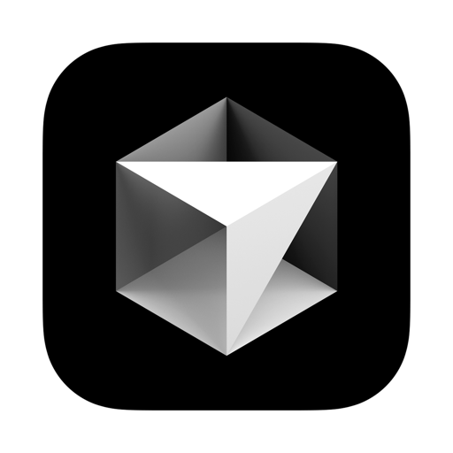

<h1>
    Hi there  
    
</h1>

 
 
 
 

<h2> 🚀 &nbsp;Skills</h2>
    

    
    
    
     
    
    
    
        
    
    
    
<h2> 🛠️ &nbsp;Tools</h2>

    
    
    
    
    
    
    
    
    

    

